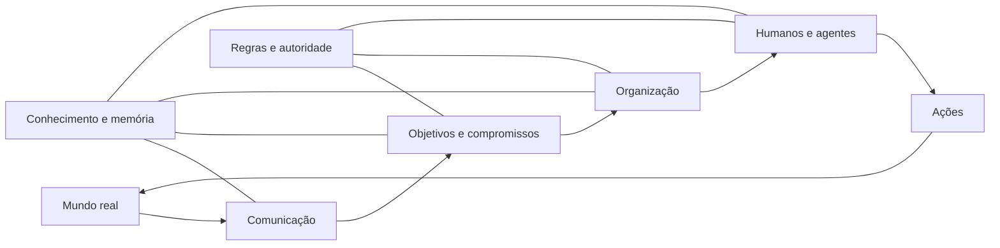
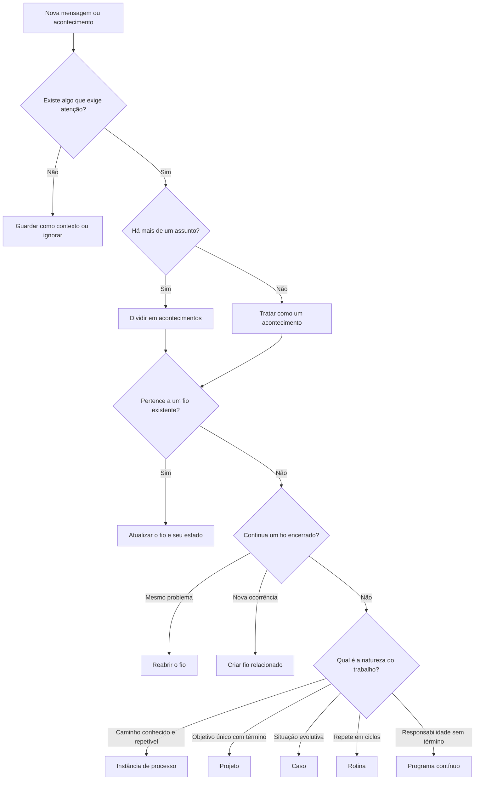
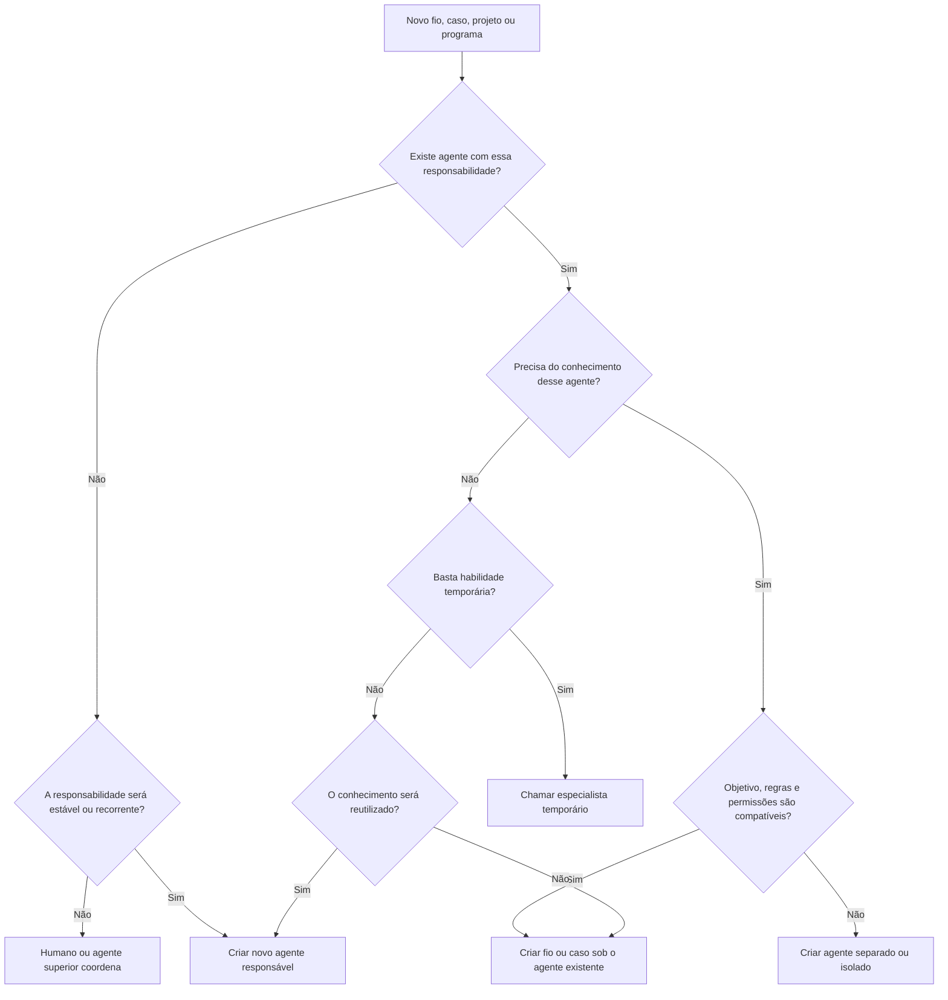
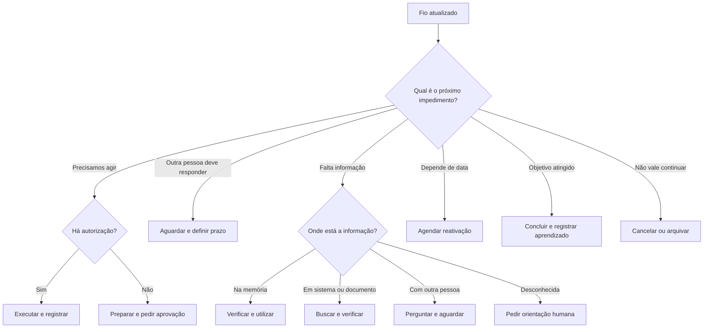

# Árvores de decisão e fluxos já discutidos

Estes modelos conectam os eixos. As definições permanecem nos documentos de descobertas de cada eixo.

## Fluxo abstrato do sistema



## Fluxo operacional

```text
comunicação
→ identificar acontecimentos
→ separar ou localizar fios
→ encontrar ou criar objetivo, caso, projeto ou processo
→ localizar o papel responsável
→ localizar ou ativar humano ou agente
→ atualizar memória e estado
→ identificar o próximo impedimento
→ agir, aguardar, perguntar, agendar ou concluir
→ observar o resultado
→ devolver aprendizado ao nível adequado
```

## Árvore de classificação do trabalho



## Árvore para decidir se precisamos de outro agente



## Árvore da próxima ação



## Pedido de informação

```text
informação solicitada
→ classificar tipo, finalidade e sensibilidade
→ conhecida, verificada, atual e permitida? → responder
→ conhecida, mas não verificada? → confirmar
→ inferida? → confirmar ou responder com ressalva
→ disponível em sistema? → buscar e validar
→ pesquisável externamente? → acionar pesquisador
→ depende de pessoa? → perguntar e aguardar
→ conflitante? → reconciliar fontes
→ restrita? → pedir autorização ou recusar
→ indisponível? → propor alternativa ou encerrar ramo
```

## Referências internas

- [Comunicação](../01-communication-and-events/current-findings.md)
- [Identificação e roteamento](../02-identification-and-routing/current-findings.md)
- [Objetivos e objetos de trabalho](../03-goals-and-work-objects/current-findings.md)
- [Distribuição e coordenação](../04-task-distribution-and-coordination/current-findings.md)
- [Arquitetura dos agentes](../05-agent-architecture/current-findings.md)
- [Persistência](../07-persistence-and-lifecycle/current-findings.md)
- [Memória](../08-memory-and-knowledge/current-findings.md)
- [Governança](../09-governance-authority-and-evaluation/current-findings.md)
